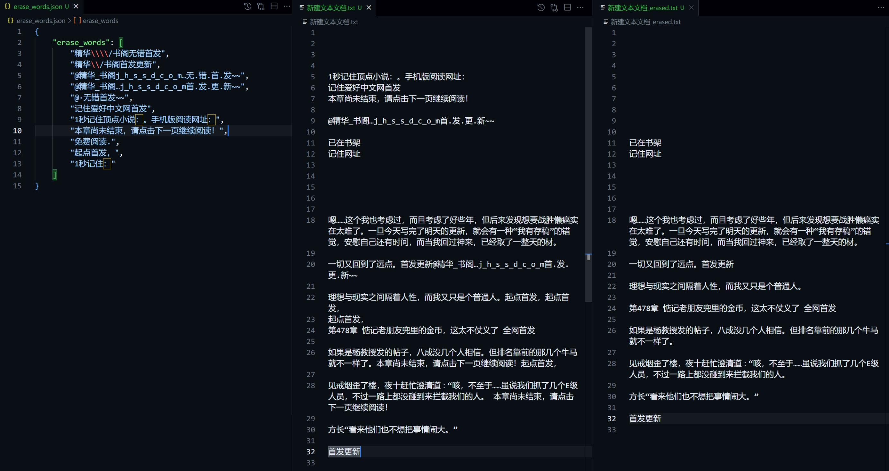

# 当前支持网站

| 网站 | 推荐程度 |
| :----: | :-------- |
| [83中文网](https://www.83zws.com/) | &#9733;&#9733;&#9733;&#9733;&#9733; |
| [UU看书](https://www.uuks5.com/) | &#9733;&#9733;&#9733;&#9733; |
| [千叶阁](https://www.qianyege.com/) | &#9733;&#9733;&#9733; |
| [笔趣阁](https://www.bqgui.cc/) | &#9733;&#9733;&#9733; |

# 功能演示

## web_crawler.py

- 从特定网站爬取文本

## local_crawler.py

- 从本地html文件读取文本

## label_test.py

- 添加xml标记

- 添加段间空行

## erase_word.py

- 清除文本中的垃圾词组

# 更新日志

## 初版

目前只测试一个网站：[31小说](https://www.31xs.com/)

使用时在main函数中修改小说名和对应的目录页url即可

## 2024/05/15 更新

发现[31小说](https://www.31xs.com/)加入了反爬机制，尝试很久无法突破反爬，无奈之下走起了歪门邪道

通过Quicker模拟人类操作浏览器，访问网址并保存html，再用python脚本处理本地html。

此方法理论上十分强大，除了有需要点击“我不是机器人”或做选图片测试的那种检测，一般不会被服务器拒绝。

缺点就是，速度很慢。

Quicker动作库链接如下：

[反爬-下载html](https://getquicker.net/Sharedaction?code=aaf6e0b2-35dc-4040-c2d6-08dc74bc40ca&fromMyShare=True)

使用流程：

0. 确认脚本和Quicker读取文件的路径是否正确（默认是绝对路径，不同计算机上需要单独设置），确认小说名和网址

1. 在小说目录页手动保存html，命名为`content.html`，放在`.\files\`目录下

2. 运行 `extract_chapter_info.py`，获得`chapter_name.txt`和`chapter_url`文件

3. 运行Quicker动作，下载html

4. 将下载好的html文件移动到`.\files\`目录下，运行`local_crawler.py`，获得小说文件

## 2024/05/29 更新

新增电子书[修订记录](ebook/README.md)线上同步

## 2024/05/30 更新

测试了下列网站：

[UU看书](https://www.uuks5.com/)

[笔趣阁](https://www.bqgui.cc/)

## 2024/06/01 更新

更新了清除垃圾词的脚本

## 2024/06/03 更新

测试了下列网站：

[千叶阁](https://www.qianyege.com/)

[83中文网](https://www.83zws.com/)